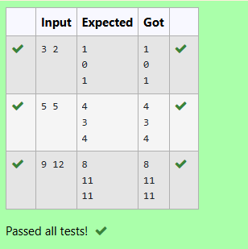

# 🔢 Calculate the Maximum Bitwise Values
## 📚 Task
Write a function calculate_the_maximum(int n, int k) to find:

The maximum AND value of any two numbers from 1 to n that is less than k

The maximum OR value of any two numbers from 1 to n that is less than k

The maximum XOR value of any two numbers from 1 to n that is less than k

Each result should be printed on a new line.

## 💡 Bitwise Operations Reminder
Operator	Name	Example
&	AND	5 & 3 = 1
`	`	OR
^	XOR	5 ^ 3 = 6


## 🔍 How It Works
We compare every pair of numbers between 1 and n

We apply AND, OR, and XOR

We only keep results that are less than k

We print the maximum values we found for each

## 🧑‍💻 Code
```
#include <stdio.h>

void calculate_the_maximum(int n, int k) {
    int max_and = 0, max_or = 0, max_xor = 0;

    for (int i = 1; i < n; i++) {
        for (int j = i + 1; j <= n; j++) {
            int and_val = i & j;
            int or_val = i | j;
            int xor_val = i ^ j;

            if (and_val < k && and_val > max_and) {
                max_and = and_val;
            }
            if (or_val < k && or_val > max_or) {
                max_or = or_val;
            }
            if (xor_val < k && xor_val > max_xor) {
                max_xor = xor_val;
            }
        }
    }

    printf("%d\n%d\n%d\n", max_and, max_or, max_xor);
}

int main() {
    int n, k;
    scanf("%d %d", &n, &k);
    calculate_the_maximum(n, k);
    return 0;
}

```
## 🧪 Output

## ✅ What You Learn
💡 Using bitwise operators

🔁 Using loops to try all number combinations

📥 Taking user input and printing results