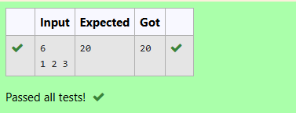

# 📈 Find the Nth Term of a Special Series
## 📚 Task
There is a number series where:

Each number after the third is the sum of the previous 3 numbers.

For example, if the first three numbers are 1 2 3, then the series looks like:
```
1 2 3 6 11 20 37 68 125 ...
```
Your task is to print the Nth number in this series.

## 🧾 Input Format
First line: An integer n (position in the series)

Second line: Three space-separated integers (the first three terms)

## 🧑‍💻 Code
```
#include <stdio.h>
int func(int a){
    if (a==1){ 
        return 1;
    }
    if (a==2){ 
        return 2;
    }
    if (a==3){ 
        return 3;
    }
    
    return( func(a-1) + func(a-2) + func(a-3) );
    
}
int main(){
    int a;
    scanf("%d",&a);
    printf("%d",func( a));
    
}
```

## ✅ Output


## 🧠 What You Learn
📥 Taking input

➕ Working with sequences and logic

🔁 Using Recurssion

📤 Printing output

