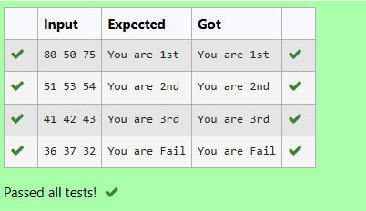

# 🎯 Student Exam Result Evaluation
## 🧾 Aim
To write a C program that reads marks of 3 subjects for a student, calculates the total and percentage, and determines the division (1st, 2nd, 3rd, or Fail) based on the percentage using conditional statements.

## 📋 Algorithm
Start

Read marks for 3 subjects from the user.

Calculate the total marks:

total = mark1 + mark2 + mark3

Calculate percentage:

percentage = total / 3.0

Use if-else statements to determine the division:

If percentage >= 60, print "You are 1st"

Else if percentage >= 50, print "You are 2nd"

Else if percentage >= 40, print "You are 3rd"

Else, print "You are Fail"

End

## 💻 Program 
```
#include <stdio.h>

#define STUDENTS 20
void evaluateStudent(int total) {
    float percentage = (float)total / 3;

    if (percentage >= 60) {
        printf("You are 1st\n");
    } else if (percentage >= 50) {
        printf("You are 2nd\n");
    } else if (percentage >= 40) {
        printf("You are 3rd\n");
    } else {
        printf("You are Fail\n");
    }
}

int main() {
    int mark1,mark2,mark3;
    int sum;
    scanf("%d %d %d",&mark1,&mark2,&mark3),
    sum=mark1+mark2+mark3;
    evaluateStudent(sum);


    return 0;
}

```
## 🧪 Output

## ✅ Result
The program successfully:

Reads three subject marks.

Calculates total and percentage.

Displays the correct division based on percentage using conditional statements.